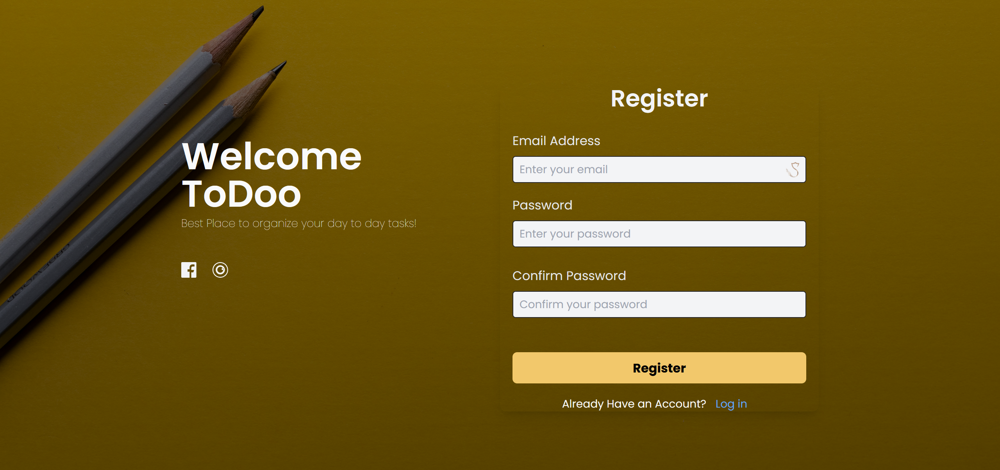

# ToDoo

A To-Do list app with online user logins for personalized task management.

## Tech Stack

### Frontend

<table style="width: 100%; display: flex; flex-wrap: wrap; justify-content: center; padding: 10px;">
  <tr>
    <td align="center" width="20">
      
       React
    </td>
    <td align="center" width="20">
      
       Tailwind
    </td>
    <td align="center" width="20">
      
       HTML5
    </td>
    <td align="center" width="20">
      
       TypeScript
    </td>
    <td align="center" width="20">
      
       Shadcn
    </td>
  </tr>
</table>

### Backend

<table>
  <tr>
    <td align="center" width="20">
      
       Express
    </td>
    <td align="center" width="20">
      
       Node.js
    </td>
    <td align="center" width="20">
      
       MySQL
    </td>
    <td align="center" width="20">
      
       JavaScript
    </td>
  </tr>
</table>

### Tools

<table>
  <tr>
    <td align="center" width="20">
      
       GitHub
    </td>
    <td align="center" width="20">
      
       Postman
    </td>
    <td align="center" width="20">
      
       Figma
    </td>
    <td align="center" width="20">
      
       NPM
    </td>
    <td align="center" width="20">
      
       VS 
    </td>
    <td align="center" width="108">
      
       Vite
    </td>
  </tr>
</table>

# Project Documentation

## Login Page

The login page is designed to be **fully responsive** for both desktop and mobile users. It uses state management to handle form inputs and error tracking effectively. This means that when a user enters incorrect information, the page immediately updates to display error messages and guides them towards correct input. The layout adapts seamlessly across different screen sizes, ensuring an optimal user experience on both mobile and desktop devices.

### Features:
- **Responsiveness**: Adjusts layout and elements for mobile and desktop views.
- **Error Handling**: Uses state to manage and display form errors in real time.
- **Intuitive Design**: A simple and clean design that provides visual feedback for user actions.

### Register Page

The register page is also responsive and optimized for a user-friendly experience across different devices. One unique feature of the register page is its **password strength indicator**. Using state management, the application dynamically tracks and displays password strength as the user types, providing instant feedback on whether the password is weak, moderate, or strong. This ensures users create secure passwords in line with best practices.

 ### Features:
- **Responsiveness**: The layout adjusts for both mobile and desktop screens.
- **Password Strength Indicator**: Uses state to evaluate password strength in real-time and display visual feedback.
- **Error Handling**: Provides immediate feedback for any form input errors to guide the user.

### Screenshots
**Login and Register**

       
    

**Home Page**

#### Desktop

       
    
      
     

#### Mobile

       
    
      
     
     

**Other**

Task card:

      

Success Toasts:
 
    

Finished Tasks:
 
       

## Future Updates

Here are some exciting features I plan to add in the future:

### 1. **Collections**
- Users will be able to group their tasks into different collections or categories (e.g., Work, Personal, Study).
- This feature will allow for better organization and management of tasks.

### 2. **Notifications**
- A notification system will alert users when tasks are due or approaching their deadline.
- Users will be able to customize notification settings (e.g., frequency, time of notification).

### 3. **Reminder System**
- A reminder feature will allow users to set reminders for specific tasks, which can trigger notifications at chosen times.
- The reminder system will include options for recurring tasks and one-time reminders.
  
These features will enhance the user experience and make managing tasks even more efficient!
